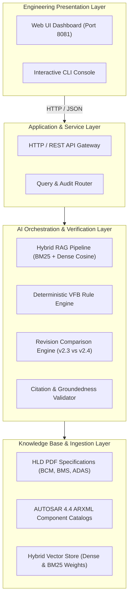
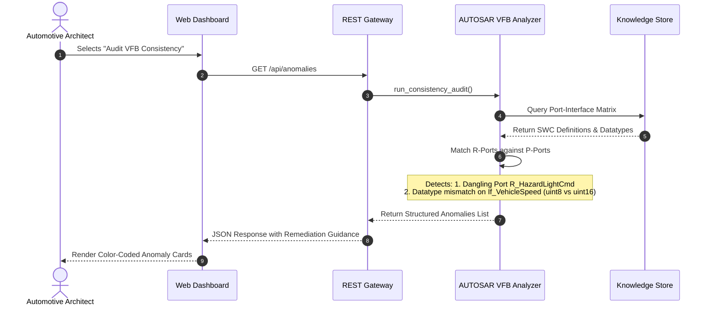

# AUTOSAR-AI SYSTEM ARCHITECTURE & DATA FLOW

## 1. High-Level System Architecture Diagram

```mermaid
flowchart TD
    subgraph UI ["Engineering Presentation Layer"]
        WUI["Web UI Dashboard (Port 8081)"]
        CLI["Interactive CLI Console"]
    end

    subgraph API ["Application & Service Layer"]
        HANDLER["HTTP / REST API Gateway"]
        ROUTER["Query & Audit Router"]
    end

    subgraph ENGINE ["AI Orchestration & Verification Layer"]
        RAG["Hybrid RAG Pipeline (BM25 + Dense Cosine)"]
        ANALYZER["Deterministic VFB Rule Engine"]
        DIFF["Revision Comparison Engine (v2.3 vs v2.4)"]
        GUARD["Citation & Groundedness Validator"]
    end

    subgraph DATA ["Knowledge Base & Ingestion Layer"]
        PDF["HLD PDF Specifications (BCM, BMS, ADAS)"]
        ARXML["AUTOSAR 4.4 ARXML Component Catalogs"]
        VEC["Hybrid Vector Store (Dense & BM25 Weights)"]
    end

    UI -->|HTTP / JSON| API
    API --> ENGINE
    ENGINE --> DATA
```

## 2. Sequence Diagram: Inconsistency Verification Flow

```mermaid
sequenceDiagram
    autonumber
    actor Engineer as Automotive Architect
    participant UI as Web Dashboard
    participant API as REST Gateway
    participant RuleEngine as AUTOSAR VFB Analyzer
    participant DB as Knowledge Store

    Engineer->>UI: Selects "Audit VFB Consistency"
    UI->>API: GET /api/anomalies
    API->>RuleEngine: run_consistency_audit()
    RuleEngine->>DB: Query Port-Interface Matrix
    DB-->>RuleEngine: Return SWC Definitions & Datatypes
    RuleEngine->>RuleEngine: Match R-Ports against P-Ports
    Note over RuleEngine: Detects: 1. Dangling Port R_HazardLightCmd<br/>2. Datatype mismatch on If_VehicleSpeed (uint8 vs uint16)
    RuleEngine-->>API: Return Structured Anomalies List
    API-->>UI: JSON Response with Remediation Guidance
    UI-->>Engineer: Render Color-Coded Anomaly Cards
```
